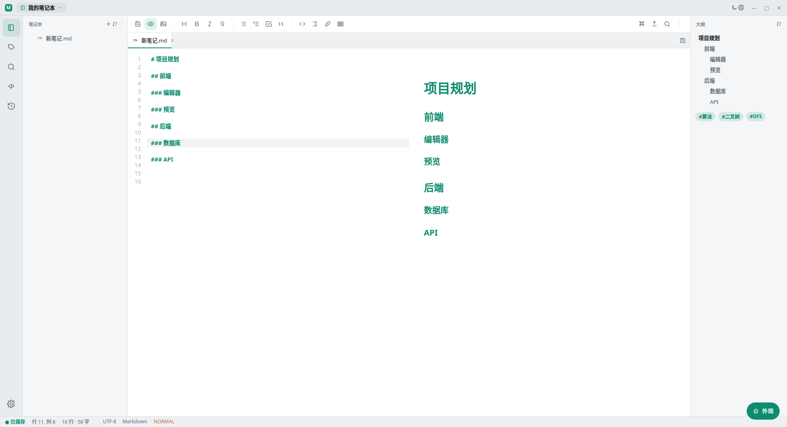
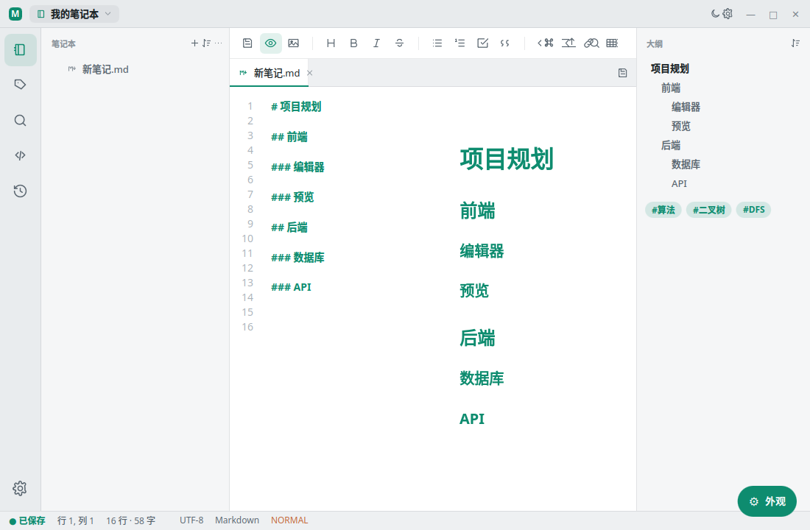

<div align="center">


# Markly

**一款现代化的 Qt 6 Markdown 笔记应用**

以笔记本为中心 · 全文检索 · 实时预览 · 思维导图 · Vi 模式

</div>



## 特性

**编辑与预览**
- 三种界面风格（Refined / Focus / Workbench），亮 / 暗主题，强调色可自定义
- 源码 / 预览 / 分屏 / 思维导图四种视图，一键循环切换
- Markdown 语法高亮、行号、自动保存、会话恢复
- 可选 **Vi 模式**：Normal / Insert / Visual，动作 + 文本对象、寄存器、宏录制（`q`/`@`）、`.` 重复
- **Hunspell 拼写检查**，右键替换建议

**渲染**
- QtWebEngine 实时预览，滚动同步
- **KaTeX** 数学公式、代码高亮
- 图表一应俱全：**Mermaid / Graphviz / Flowchart.js / WaveDrom / PlantUML**
- **思维导图**：标题大纲一键生成可交互导图（MindElixir），可编辑并回写笔记

**组织与检索**
- 笔记本（bundle 格式，JSON 配置 + SQLite 索引）
- **SQLite FTS5 全文检索**：按名称 / 内容 / 路径 / 标签过滤
- 层级标签、快速访问、历史记录
- `Ctrl+P` 统一入口：模糊跳转笔记 + 运行命令

**导出与分享**
- 导出 Markdown / HTML / **PDF**
- Pandoc 集成：**Word (docx) / EPUB / LaTeX**、含目录 HTML
- 文件夹合并导出（多笔记合成单文档）
- **图床**：GitHub / Gitee / 自建 Git 仓库，一键上传本地图片并替换链接

**桌面集成**
- 系统托盘、最小化到托盘、自动检查更新
- 全局热键呼出（X11）、单实例
- PDF / HTML 内置查看器
- 外部命令任务系统（自定义构建 / 脚本）
- 代码片段、模板、魔法词（`%date%`、`%note%` 等）

## 截图

| 欢迎页 | 工作台 |
|---|---|
|  |  |

## 构建

**依赖**：Qt ≥ 6.8（base / declarative / webengine）、CMake ≥ 3.20、Ninja、Hunspell。
可选：Pandoc（高级导出）、xcb / xcb-keysyms（X11 全局热键）。

```bash
# Arch Linux
sudo pacman -S qt6-base qt6-declarative qt6-webengine hunspell cmake ninja

# 构建
cmake -B build -S . -G Ninja -DCMAKE_BUILD_TYPE=Release
cmake --build build

# 运行
./build/src/markly

# 测试（26 个单元/集成/冒烟测试）
ctest --test-dir build --output-on-failure
```

## 打包

```bash
# Linux 通用包（TGZ + 自解压 STGZ；有 dpkg-deb / rpmbuild 时自动追加 DEB / RPM）
cd build && cpack

# Arch Linux
cd packaging && makepkg -si
```

Windows（NSIS）与 macOS（dmg）经 CI 矩阵构建，见 `.github/workflows/release.yml`。

## 技术栈

- **C++17 / Qt 6.8**：QML 界面外壳 + QWidget 编辑器内核的混合架构
- **QtWebEngine**：预览渲染、图表、思维导图
- **SQLite FTS5**：笔记索引与全文检索
- 纯逻辑核心层与 UI 桥接层分离，核心逻辑全部可无头（GUILESS）单测

## 许可证

[MIT](LICENSE)
