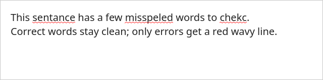

# 拼写检查（Hunspell）— spec #8c

对标 vnote-3201 的拼写检查：用系统 **libhunspell** + en_US 词典检查英文单词，在
Markdown 编辑器中对拼错单词加红色波浪下划线，可在设置中开关（默认关）。

## 组成

| 层 | 文件 | 职责 |
| --- | --- | --- |
| 核心 | `src/core/spell/spellchecker.{h,cpp}` | libhunspell C API 封装：`check` / `suggest` / `ready` |
| 共享实例 | `src/core/marklyapp.{h,cpp}` | `getSpellChecker()` 懒加载共享 SpellChecker + 词典目录解析 |
| 高亮 | `src/widgets/editors/markdownhighlighter.{h,cpp}` | `highlightBlock` 末尾拼写 pass：波浪下划线 |
| 配置 | `src/core/editorconfig.{h,cpp}` | `spell_check` 键（默认 false） |
| QML 桥 | `src/widgets/editors/editorcfgqml.{h,cpp}` | `EditorCfg.spellCheck` 可读写属性 |
| 设置 UI | `src/qml/shell/SettingsDialog.qml` | 「编辑器」分类「拼写检查」开关 |
| 词典 | `src/data/dicts/en_US.aff` + `en_US.dic` | 随 app 分发（源自系统词典） |

## SpellChecker

- 用 **Hunspell C API**（`Hunspell_create/destroy/spell/suggest/free_list`），句柄存
  `void *m_handle` 以避免把 C 头泄漏进其它头文件。
- 编码：读取 `.aff` 的 `SET`（en_US 为 `UTF-8`），用 Qt6 `QStringConverter`
  在 UTF-8 / Latin1 间转换（不依赖 Core5Compat 的 QTextCodec）。
- **安全降级**：词典加载失败时 `ready()=false`、`check()` 一律返回 true（不误报），
  `suggest()` 返回空。

## 词典目录解析（getSpellChecker）

懒加载，首个包含 `en_US.dic` 的目录优先：

1. `MARKLY_DICT_DIR` 环境变量（测试/离线用）
2. `<config>/dicts`（`ConfigMgr::getUserDictsFolder()`）
3. app 内置 `data/dicts`（`ConfigMgr::getAppDictsFolder()`）

## 高亮 pass

`MdHighlighter::highlightBlock` 末尾（围栏代码块已提前 return）：

- 仅当 `MarkdownHighlighter.spellCheck`（绑定 `EditorCfg.spellCheck`）开启且
  `SpellChecker.ready()` 时执行。
- 正则 `[A-Za-z]{2,}` 取词（跳过纯数字/符号、单字母）。
- 行内代码 `` `...` `` span 内的词跳过。
- 拼错词：在该位置**已有语法格式之上叠加** `SpellCheckUnderline` + 红色（先
  `format(pos)` 取现有格式再 set，保留语法前景色）。
- `spellCheck` / 主题变化 → `rehighlight()`。

## 设置开关

设置对话框「编辑器」分类新增「拼写检查」toggle（英文翻译 "Spell check"，已加入
`markly_en_US.ts/.qm`，lrelease 重生成共 33 条）。切换即时 `rehighlight`。

## 验证

- **单元测试** `tests/test_spell.cpp`（GUILESS，CMake 经 `SRC_DICT_DIR` 宏传词典）：
  - `check("hello")=true`、`check("helllo")=false`、`suggest("helllo")` 非空；
  - 无词典目录 → `ready()=false`、`check(任意)=true`、`suggest` 空（安全降级）。
  - `ctest -R test_spell` 通过；全套 18 测试全绿。
- **视觉**：`docs/spell-check/images/spell-underline.png`，真实 SpellChecker +
  `SpellCheckUnderline` 在 QTextEdit 中对 "sentance/misspeled/chekc" 渲染红色波浪线、
  正确词保持干净（offscreen 渲染；shell 截图需已打开的笔记本会话，故用等价的最小
  渲染做像素验证）。

## 构建依赖

`src/CMakeLists.txt`：`find_package(PkgConfig)` + `pkg_check_modules(HUNSPELL REQUIRED
hunspell)`，`markly_core` 链接 `${HUNSPELL_LIBRARIES}`。Arch 包：`hunspell` +
`hunspell-en_US`（或仓库自带 `src/data/dicts`）。

## 后续小迭代（再规划）

- 右键拼写建议替换菜单（`suggest()` 已就绪，仅缺 UI）。
- 「添加到自定义词典」/ 忽略列表。
- 多语言词典（zh/其它）与按文档语言切换。
